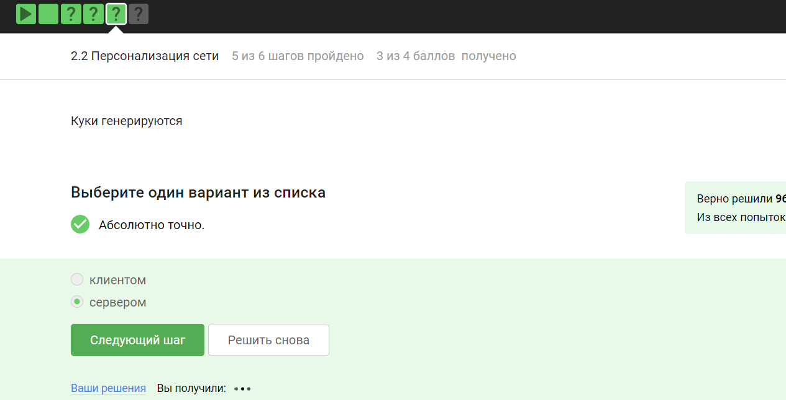

---
## Front matter
lang: ru-RU
title: "Внешний курс. Блок 1: Безопасность в сети"
subtitle: Основы информационной безопасности
author:
  - Петрова А.А.
institute:
  - Российский университет дружбы народов, Москва, Россия
date: 16 мая 2025

## i18n babel
babel-lang: russian
babel-otherlangs: english

## Fonts
mainfont: PT Serif
romanfont: PT Serif
sansfont: PT Sans
monofont: PT Mono
mainfontoptions: Ligatures=TeX
romanfontoptions: Ligatures=TeX
sansfontoptions: Ligatures=TeX,Scale=MatchLowercase
monofontoptions: Scale=MatchLowercase,Scale=0.9

## Formatting pdf
toc: false
toc-title: Содержание
slide_level: 2
aspectratio: 169
section-titles: true
theme: metropolis
header-includes:
 - \metroset{progressbar=frametitle,sectionpage=progressbar,numbering=fraction}
 - '\makeatletter'
 - '\beamer@ignorenonframefalse'
 - '\makeatother'
---

# Информация

## Докладчик

  * Петрова Алевтина Александровна
  * НКАбд-04-23
  * Российский университет дружбы народов
  

## Цель

Целью данной работы является приобретение практических навыков
установки операционной системы на виртуальную машину, настройки ми-
нимально необходимых для дальнейшей работы сервисов.

## Задание

Выполнение контрольных заданий первого блока внешнего курса "Основы Кибербезопасности"

## Вопрос 2.1.1
UDP - протокол сетевого уровня 
TCP - протокол транспортного уровня
HTTPS - протокол прикладного уровня
IP - протокол сетевого уровня,
поэтому ответ HTTPS

{#fig:005 width=70%}

## Вопрос 2.1.2
Ранее было упомянуто, что протокол TCP - transmission control protocol - работает на транспортном уровне

{#fig:006 width=70%}

## Вопрос 2.1.3
В адресе типа IPv4 не может быть чисел больше 255, поэтому первые два варианта не подходят

{#fig:007 width=70%}

## Вопрос 2.1.4
DNS-сервер, Domain name server — приложение, предназначенное для ответов на DNS-запросы по соответствующему протоколу Обязательное условие – Сопоставление сервером доменных имен доменного имени с IP-адресом называется разрешением имени и адреса

{#fig:008 width=70%}

## Вопрос 2.1.5
Распределение протоколов в модели TCP/IP:

- Прикладной уровень (Application Layer): HTTP, RTSP, FTP, DNS.

- Транспортный уровень (Transport Layer): TCP, UDP, SCTP, DCCP.

- Сетевой (Межсетевой) уровень (Network Layer): IP.

- Уровень сетевого доступа (Канальный) (Link Layer): Ethernet, IEEE 802.11, WLAN, SLIP, Token Ring, ATM и MPLS.
 
{#fig:09 width=50%}

## Вопрос 2.1.6
Протокол http передает не зашифрованные данные, а протокол https уже будет передавать зашифрованные данные

{#fig:017 width=70%}

## Вопрос 2.1.7
https передает зашифрованные данные, одна из фаз - передача данных, другая должна быть рукопожатием 

{#fig:018 width=70%}

## Вопрос 2.1.8
TLS определяется и клиентом, и сервером, чтобы было возможно подключиться

{#fig:019 width=70%}

## Вопрос 2.1.9
Ответ на изображении, остальные варианты в протоколе предусмотрены

{#fig:019 width=70%}

## Вопрос 2.2.1
Куки точно не хранят пароли и IP-адреса, а id ceccии и идентификатор хранят

{#fig:019 width=70%}

## Вопрос 2.2.2
Конечно же, куки не делают соединение более надежным

{#fig:019 width=70%}

## Вопрос 2.2.3
Ответ на изображении

{#fig:019 width=70%}

## Вопрос 2.2.4
Сессионные куки хранятся в течение сессии, то есть пока используется веб-сайт

{#fig:019 width=70%}

## Вопрос 2.3.1
Необходимо три узла - входной, промежуточный и выходной

{#fig:019 width=70%}

## Вопрос 2.3.2
IP-адрес не должен быть известен охранному и промежуточному узлам

{#fig:019 width=70%}

## Вопрос 2.3.3
Отправитель генерирует общий секретный ключ со узлами, через которые идет передача, то есть со всеми

{#fig:019 width=70%}

## Вопрос 2.3.4
Для получения пакетов не нужно использовать TOR. TOR — это технология, которая позволяет с некоторым успехом скрыть личность человека в интернете

{#fig:019 width=70%}

## Вопрос 2.4.1
Действительно, это определение Wi-Fi

{#fig:019 width=70%}

## Вопрос 2.4.2
Для целей работы в Интернете Wi-Fi обычно располагается как канальный уровень (эквивалентный физическому и канальному уровням модели OSI) ниже интернет-уровня интернет-протокола. Это означает, что узлы имеют связанный интернет-адрес, и при подходящем подключении это обеспечивает полный доступ в Интернет.

{#fig:019 width=70%}

## Вопрос 2.4.3
WEP (Wired Equivalent Privacy) – устаревший и небезопасный метод проверки подлинности. Это первый и не очень удачный метод защиты. Злоумышленники без проблем получают доступ к беспроводным сетям, которые защищены с помощью WEP, был заменен остальными представленными

{#fig:019 width=70%}

## Вопрос 2.4.4
Нужно аутентифицировать устройства и позже передаются зашифрованные данные

{#fig:019 width=70%}

## Вопрос 2.4.5
Исходя из названия, можно понять, что WPA2 Personal для личного использования, то есть для домашней сети, enterprise - для предприятий

{#fig:019 width=70%}

## Вывод

В ходе выполнения блока "Безопасность в сети" узнала о работе базовых сетевых протоколов, куки сетей Wi-Fi и браузера TOR.

