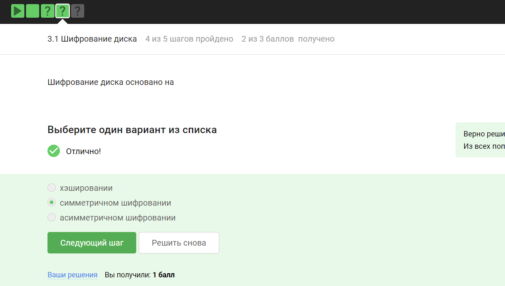

---
## Front matter
lang: ru-RU
title: "Внешний курс. Блок 2: Защита ПК/Телефона"
subtitle: Основы информационной безопасности
author:
  - Петрова А.А.
institute:
  - Российский университет дружбы народов, Москва, Россия
date: 16 мая 2025

## i18n babel
babel-lang: russian
babel-otherlangs: english

## Fonts
mainfont: PT Serif
romanfont: PT Serif
sansfont: PT Sans
monofont: PT Mono
mainfontoptions: Ligatures=TeX
romanfontoptions: Ligatures=TeX
sansfontoptions: Ligatures=TeX,Scale=MatchLowercase
monofontoptions: Scale=MatchLowercase,Scale=0.9

## Formatting pdf
toc: false
toc-title: Содержание
slide_level: 2
aspectratio: 169
section-titles: true
theme: metropolis
header-includes:
 - \metroset{progressbar=frametitle,sectionpage=progressbar,numbering=fraction}
 - '\makeatletter'
 - '\beamer@ignorenonframefalse'
 - '\makeatother'
---

# Информация

## Докладчик

  * Петрова Алевтина Александровна
  * НКАбд-04-23
  * Российский университет дружбы народов
  

## Цель

Пройти второй блок курса "Основы кибербезопасности"

## Задание

Выполнение контрольных заданий блока 2: Защита ПК/Телефона

## Вопрос 3.1.1
Шифрование диска — технология защиты информации, переводящая данные на диске в нечитаемый код, который нелегальный пользователь не сможет легко расшифровать. Соответственно, можно.

{#fig:005 width=70%}

## Вопрос 3.1.2
Шифрование диска основано на симметричном шифровании

{#fig:006 width=70%}

## Вопрос 3.1.3
Отмечены программы, с помощью которых можно зашифровать жесткий диск 

{#fig:007 width=70%}

## Вопрос 3.2.1
Стойкий пароль - тот, который тяжелее подобрать, он должен быть со спец. символами и длинный 

{#fig:008 width=70%}

## Вопрос 3.2.2
Все варианты, кроме менеджера паролей, совершенно не надежные

{#fig:09 width=50%}

## Вопрос 3.2.3
Капча нужна для проверки на то, что за экраном "не робот"

{#fig:017 width=70%}

## Вопрос 3.2.4
Опасно хранить пароли в открытом виде, поэтому хранят их хэши

{#fig:018 width=70%}

## Вопрос 3.2.5
Соль не поможет 

{#fig:019 width=70%}

## Вопрос 3.2.6
Все приведенные меры защищают от утечек данных 

{#fig:019 width=70%}

## Вопрос 3.3.1
Фишинговые ссылки очень похожи на ссылки известных сервисов, но с некоторыми отличиями

{#fig:019 width=70%}

## Вопрос 3.3.2
Да, может, например, если пользователя со знакомым адресом взломали

{#fig:019 width=70%}

## Вопрос 3.4.1
Ответ дан в соответствии с определением 

{#fig:019 width=70%}

## Вопрос 3.4.2
Трояны маскируются под обычную программу

{#fig:019 width=70%}

## Вопрос 3.5.1
При установке первого сообщения отправителем формируется ключ шифрования

{#fig:019 width=70%}

## Вопрос 3.5.2
Суть сквозного шифрования состоит в том, что сообщения передаются по узлам связи в зашифрованном виде

{#fig:019 width=70%}

## Вывод

Был пройден второй блок курса "Основы кибербезопасности", изучены правила хранения паролей и основная информация о вирусах

