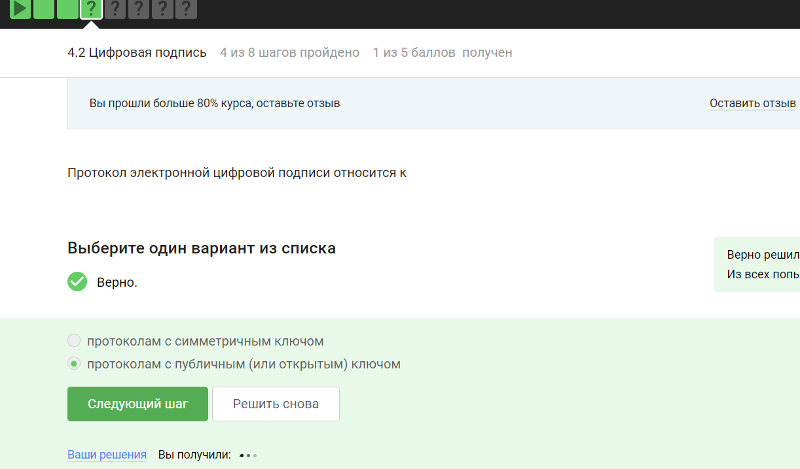

---
## Front matter
title: "Внешний курс. Блок 3: Криптография на практике"
subtitle: "Основы информационной безопасности"
author: "Петрова Алевтина Александровна"

## Generic otions
lang: ru-RU
toc-title: "Содержание"

## Bibliography
bibliography: bib/cite.bib
csl: pandoc/csl/gost-r-7-0-5-2008-numeric.csl

## Pdf output format
toc: true # Table of contents
toc-depth: 2
lof: true # List of figures
lot: true # List of tables
fontsize: 12pt
linestretch: 1.5
papersize: a4
documentclass: scrreprt
## I18n polyglossia
polyglossia-lang:
  name: russian
  options:
	- spelling=modern
	- babelshorthands=true
polyglossia-otherlangs:
  name: english
## I18n babel
babel-lang: russian
babel-otherlangs: english
## Fonts
mainfont: PT Serif
romanfont: PT Serif
sansfont: PT Sans
monofont: PT Mono
mainfontoptions: Ligatures=TeX
romanfontoptions: Ligatures=TeX
sansfontoptions: Ligatures=TeX,Scale=MatchLowercase
monofontoptions: Scale=MatchLowercase,Scale=0.9
## Biblatex
biblatex: true
biblio-style: "gost-numeric"
biblatexoptions:
  - parentracker=true
  - backend=biber
  - hyperref=auto
  - language=auto
  - autolang=other*
  - citestyle=gost-numeric
## Pandoc-crossref LaTeX customization
figureTitle: "Рис."
tableTitle: "Таблица"
listingTitle: "Листинг"
lofTitle: "Список иллюстраций"
lotTitle: "Список таблиц"
lolTitle: "Листинги"
## Misc options
indent: true
header-includes:
  - \usepackage{indentfirst}
  - \usepackage{float} # keep figures where there are in the text
  - \floatplacement{figure}{H} # keep figures where there are in the text
---

# Цель работы

Пройти третий блок курса "Основы кибербезопасности"

# Выполнение блока 3: Криптография на практике

## Введение в криптографию
 
Для ответа на вопрос используется определение ассиметричного шифрования с двумя ключами (рис. 1).

{#fig:001 width=70%}

Отмечены основные условия для криптографической хэш-функции (рис. 2).

{#fig:002 width=70%}

Отмечены алгоритмы цифровой подписи (рис. 3).

{#fig:003 width=70%}

В информационной безопасности аутентификация сообщения или аутентификация источника данных-это свойство, которое гарантирует, что сообщение не было изменено во время передачи (целостность данных) и что принимающая сторона может проверить источник сообщения (рис. 4)

{#fig:004 width=70%}

Определение обмена ключами Диффи-Хэллмана. (рис. 5).

{#fig:005 width=70%}

## Цифровая подпись

По определению цифровой подписи протокол ЭЦП относится к протоколам с публичным ключом (рис. 6).

{#fig:006 width=70%}

Алгоритм верификации электронной подписи состоит в следующем. На первом этапе получатель сообщения строит собственный вариант хэш-функции подписанного документа. На втором этапе происходит расшифровка хэш-функции, содержащейся в сообщении с помощью открытого ключа отправителя. На третьем этапе производится сравнение двух хэш-функций. Их совпадение гарантирует одновременно подлинность содержимого документа и его авторства (рис. 7).

{#fig:007 width=70%}

Электронная подпись обеспечивает все указанное, кроме конфиденциальности (рис. 8).

{#fig:008 width=70%}

Для отправки налоговой отчетности в ФНС используется усиленная квалифицированная электронная подпись (рис. 9).

{#fig:009 width=70%}

Верный ответ указан на изображении (рис. 10).

{#fig:010 width=70%}

## Электронные платежи

Известные платежные системы - Visa, MasterCard, МИР (рис. 11).

{#fig:011 width=70%}

Верный ответ на изображении (рис. 12).

{#fig:012 width=70%}

При онлайн платежах используется многофакторная аутентификация (рис. 13).

{#fig:013 width=70%}

## Блокчейн

Proof-of-Work, или PoW, (доказательство выполнения работы) — это алгоритм достижения консенсуса в блокчейне; он используется для подтверждения транзакций и создания новых блоков. С помощью PoW майнеры конкурируют друг с другом за завершение транзакций в сети и за вознаграждение.
Пользователи сети отправляют друг другу цифровые токены, после чего все транзакции собираются в блоки и записываются в распределенный реестр, то есть в блокчейн.  (рис. 14).

{#fig:014 width=70%}

Консенсус блокчейна — это процедура, в ходе которой участники сети достигают согласия о текущем состоянии данных в сети. Благодаря этому алгоритмы консенсуса устанавливают надежность и доверие к самоу сети. (рис. 15).

{#fig:015 width=70%}

Ответ - цифровая подпись (рис. 16).

{#fig:016 width=70%}

# Выводы

Третий блок пройден успешно

{#fig:017 width=70%}
